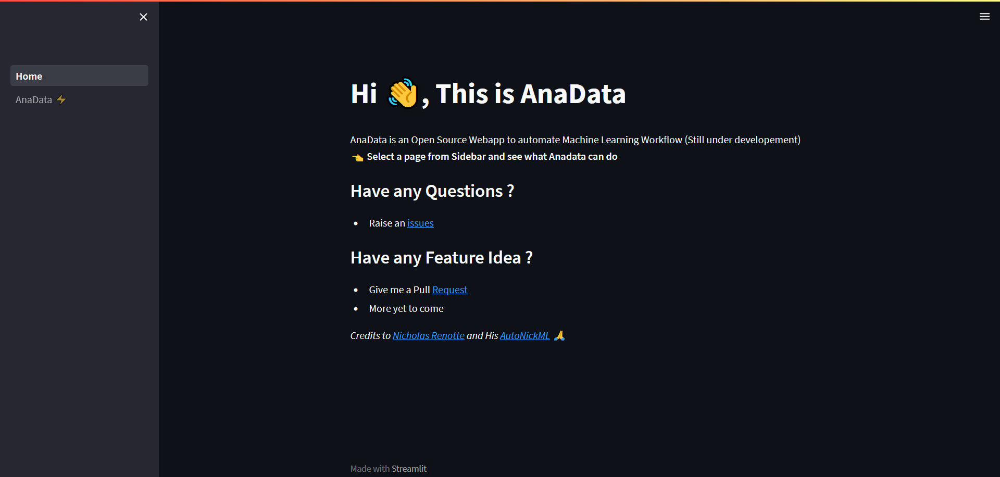

# AnaData 🤖🚀

_Where you can Visualize Datasets_

A open-source Webapp to Analyze and Visualize Data

## WebApp



## Requirements

- Python >= 3.9
- Packages with Same Version ( as mentioned in requirements.txt )

### Installation

1. Clone this Repo 👇

```
git clone https://github.com/Codechickdev/AutoMLSum.git
```

2. Open in your Editor of Choice and Install Packages ⏬

```
pip install -r requirements.txt
```

3. Run the App 🚀

```
streamlit run main.py
```

**This Repo is still in Developement Phase!!!**
